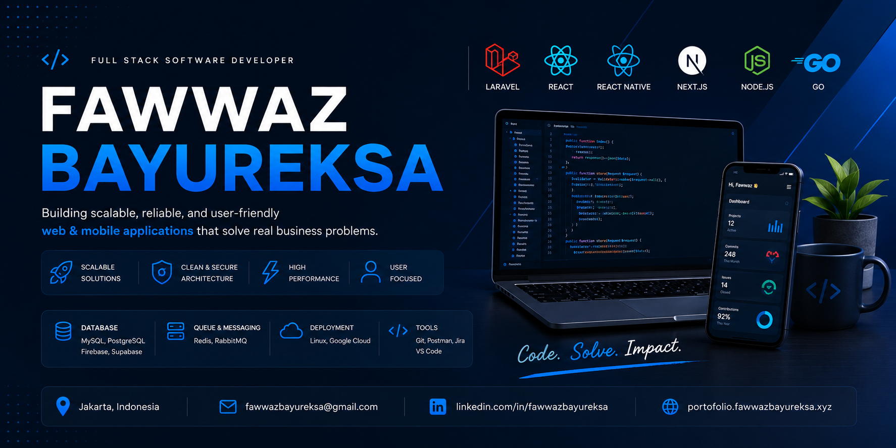

# About

Hi, I'm **Fawwaz Bayureksa**
A passionate **Full Stack Developer | Software Engineer | Laravel Specialist | React & React Native Developer | Front end Developer**

Currently working as a **SR Full Stack Developer at PT Abadi Sejahtera Finansindo**

- Experienced in building scalable web and mobile applications using Laravel, React.js, Next.js, and React Native
- Developed Customer Service ,Marketing platforms, Collection systems ,Company websites, and Mobile applications
- Experienced with Redis Queue, RabbitMQ, REST API development, and Linux server deployment
- Currently learning **Go**, Software Architecture, and Distributed Systems
- Open to collaborating on any project even Open Source Projects
- Open to new oportunity
---

# Connect With Me

---

# Tech Stack

### Frontend

### Mobile

### Backend

### Database

### DevOps & Tools

---

# Development Focus

* Full Stack Development
* Frontend Development
* Backend Development
* RESTful API Design
* Scalable Laravel Applications
* React & React Native Ecosystem
* Queue Systems (Redis)
* Message Brokers (RabbitMQ)
* Software Architecture
* Domain-Driven Design (DDD)
* Clean Code & SOLID Principles
* Deployment

---

# My GitHub Stats 

---

### Favorite Quote
- > "Do Your Best"
- > "First solve the problem, then write the code." – John Johnson
From [Fawwaz Bayureksa](https://github.com/fawazbayureksa)
